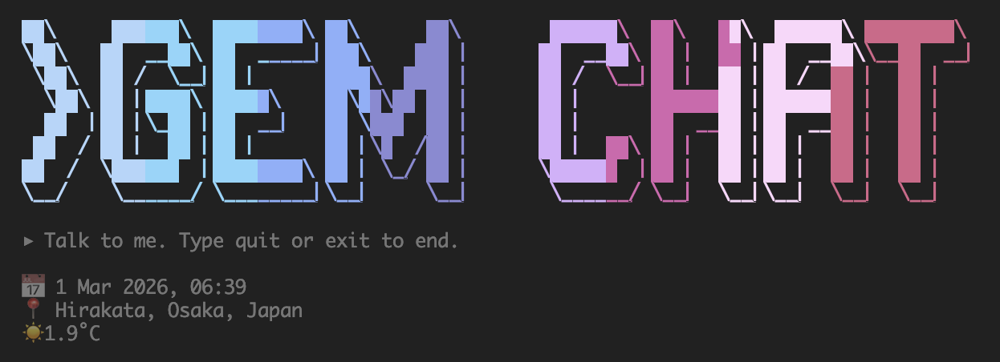

# GEM CHAT



ローカルLLM（テキスト専用）を使ったCLIチャットです。
会話は記憶としてMarkdownで蓄積され、次回起動時にコンテキストとして参照されます。

- **Mac (Apple Silicon)**: [MLX](https://github.com/ml-explore/mlx) + **Gemma-3-Glitter-12B-8bit** を自動で利用
- **その他**: Transformers + **Qwen2.5-7B-Instruct** をダウンロードして利用

`config.json` でモデルの優先順位やアシスタント名などをカスタマイズできます。

## 必要な環境

- Python 3.10 以上（3.14 では outlines はスキップされます）
- [Hugging Face](https://huggingface.co) のアカウントとログイン
- 使用モデルの利用許諾（[Qwen2.5-7B](https://huggingface.co/Qwen/Qwen2.5-7B-Instruct) / Mac では [Gemma-3-Glitter-12B-8bit](https://huggingface.co/mlx-community/Gemma-3-Glitter-12B-8bit) で Accept が必要な場合があります）

初回起動時に未ログインの場合は、ログイン処理が案内されます。

## セットアップ・起動

```bash
make
```

### Mac: 既定の MLX モデル（Gemma-3-Glitter-12B-8bit）

Mac では **mlx-community/Gemma-3-Glitter-12B-8bit** を MLX で使用します。初回は Hugging Face から自動で取得されます。

あらかじめローカルに置いておくと、起動時のダウンロードを避けられます。

```bash
huggingface-cli download mlx-community/Gemma-3-Glitter-12B-8bit \
  --local-dir models/gemma-3-glitter-12b-8bit
```

### Mac: HF モデルを MLX 4bit に変換

HF キャッシュにあるモデルを MLX 用 4bit に量子化します。既定では [Qwen/Qwen3.5-35B-A3B](https://huggingface.co/Qwen/Qwen3.5-35B-A3B) を `models/qwen3.5-35b-a3b-4bit` に保存します。

```bash
make convert-mlx-4bit
```

## config.json

プロジェクト直下に `config.json` を置くと、動作をカスタマイズできます（任意）。

```json
{
  "assistant_name": "Assistant",
  "user_name": "You",
  "model_priority": {
    "mlx": ["models/gemma-3-glitter-12b-8bit"],
    "transformers": ["Qwen/Qwen2.5-7B-Instruct"]
  }
}
```

| キー | 説明 |
|------|------|
| `assistant_name` | チャット画面に表示するアシスタント名（既定: `Gemma`） |
| `user_name` | チャット画面に表示するユーザー名（既定: `You`） |
| `model_priority.mlx` | Mac で試すモデルの優先リスト。ローカルパスまたは HF repo id |
| `model_priority.transformers` | Mac 以外（または MLX 失敗時）に試すモデルの優先リスト |

## 主な機能

- **記憶（memory.md）**  
  会話の要約を「話したこと(超要約)」「関係性」「ユーザーの人物像」の3セクションで蓄積。起動時に最優先でコンテキストに含まれます。

- **pre_loading_data/**  
  フォルダ内の全`.md`(サブフォルダ含む)を起動時に読み込み、`memory.md`の次の優先度で参照されます。

- **いま（日付・場所・天気）**  
  起動時にIPから現在地を取得し、[Open-Meteo](https://open-meteo.com/) で天気を取得し、`pre_loading_data/`の次の優先度で参照されます。

- **セッションまとめ**  
  終了時に`memory/made_in_currentchat/`の内容を1つのmdにまとめ、`memory/session_*.md`として保存します。
  セッション終了のたびに、それらの内容と`memory.md`を統合して`memory.md`を書き換えます。

## ディレクトリ構成

| パス | 説明 |
|------|------|
| `chat_cli.py` | エントリポイント。会話ループ・コンテキスト組み立て |
| `pipe_loader.py` | チャット用モデルの読み込み・解放。Mac では MLX を優先して利用 |
| `session_memory.py` | セッションまとめ・memory.md の再調整 |
| `config.json` | アシスタント名・モデル優先順位などの設定（任意） |
| `scripts/` | ユーティリティスクリプト（`convert_hf_to_mlx_4bit.py` 等） |
| `pre_loading_data/` | 起動時に読み込む .md（任意） |
| `memory/` | 記憶の棚（memory.md、session_*.md、made_in_currentchat/） |
| `banner.txt` | 起動時バナー（左→右グラデーション）。任意 |

## 操作

- ボーダー付き入力欄にテキストを入力して Enter で送信
- `quit` / `exit` / `q` で終了
- 5 往復ごとに会話が要約され、`memory/made_in_currentchat/` に追加されます
- 応答の下に経過時間が表示されます

## スペックについて

M4 MacBook Air（24GB メモリ）では MLX + Gemma-3-Glitter-12B-8bit でレスポンスは最大でも 10 秒ほどで返ってきます。